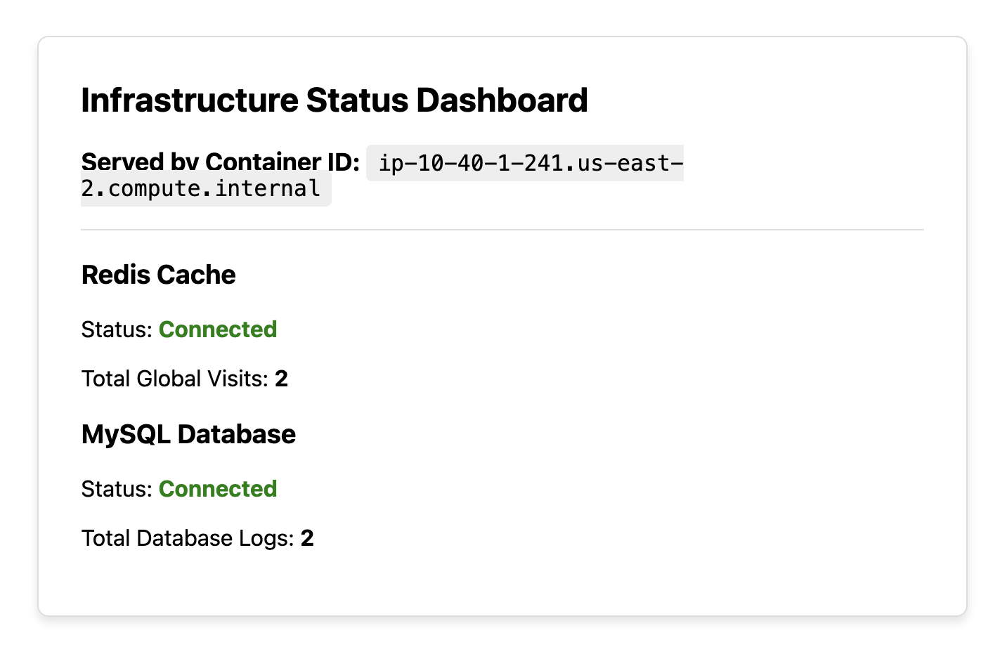

# db-checker-infra

The stack runs the provided PHP image on ECS Fargate with three replicas behind an Application Load Balancer, plus single-node MySQL and Redis containers for the data tier.

Though this repo is designed for account level separation for each environment, this instruction is for deployment to a "prod" account.

## Local Deployment

Authenticate to the target AWS account first:

- Create s3 bucket and Update the `bucket` value in [config/backend-prod.hcl](config/backend-prod.hcl) to the bucket name:

```bash
RANDOM_SUFFIX="$(date +%s)"
BACKEND_BUCKET="db-checker-tf-state-${RANDOM_SUFFIX}"

aws s3api create-bucket \
  --bucket "$BACKEND_BUCKET" \
  --region us-east-2 \
  --create-bucket-configuration LocationConstraint=us-east-2

perl -0pi -e 's/bucket\s*=\s*"[^"]+"/bucket         = "'"$BACKEND_BUCKET"'"/' config/backend-prod.hcl
```

Deploy prod:

```bash
terraform init -reconfigure -backend-config=config/backend-prod.hcl
terraform plan -var-file=config/prod.tfvars
terraform apply -var-file=config/prod.tfvars
```

Cleanup local deployment:

```bash
BACKEND_BUCKET="$(awk -F'"' '/bucket/ { print $2; exit }' config/backend-prod.hcl)"

terraform destroy -var-file=config/prod.tfvars

aws s3 rm "s3://${BACKEND_BUCKET}" --recursive
aws s3api delete-bucket \
  --bucket "$BACKEND_BUCKET" \
  --region us-east-2
```

GitHub Actions runners clean up their temporary workspace automatically after each run, so this local cleanup command is only needed when you deploy from your machine.

### Accessing the Application

After apply, Terraform prints:

```bash
application_url = "http://<alb-dns-name>"
alb_dns_name    = "<alb-dns-name>"
```
- [Application screenshot](images/Screenshot-app.png)



Open `application_url` in a browser or test it with:

```bash
curl "$(terraform output -raw application_url)"
```

### Verification

Useful checks after deployment:

```bash
terraform output application_url
aws ecs list-services --cluster prod-db-checker-cluster
aws ecs describe-services --cluster prod-db-checker-cluster --services prod-db-checker-app prod-db-checker-mysql prod-db-checker-redis
```

Expected service counts:

- App: `3` running tasks.
- MySQL: `1` running task.
- Redis: `1` running task.

The ALB target group should show the PHP app tasks as healthy once the containers can connect to MySQL and Redis.

The backend region and deployment region are both `us-east-2`.

## GitHub Actions Setup
- Create a GitHub Actions OIDC role in your AWS account for CI/CD. Attach this conservative first-run policy to the role. It is intentionally broad so Terraform can create, update, and delete the required resources without needing account-specific ARNs in the policy:

```json
{
  "Version": "2012-10-17",
  "Statement": [
    {
      "Sid": "TerraformFirstRunAccess",
      "Effect": "Allow",
      "Action": [
        "ec2:*",
        "elasticloadbalancing:*",
        "ecs:*",
        "servicediscovery:*",
        "logs:*",
        "iam:*",
        "s3:*",
        "sts:GetCallerIdentity"
      ],
      "Resource": "*"
    }
  ]
}
```
- Create Actions secret in this repo named `GA_ROLE_ARN_PROD` , the value should be the arn of the GitHub Actions OIDC role.
The workflows run:

- `terraform fmt -check -recursive`
- `terraform validate`
- `terraform plan`
- `terraform apply` on branch pushes only

`prod` deploys from the `main` branch with `config/prod.tfvars`.


## Architecture

- Public Application Load Balancer on HTTP port `80`.
- ECS Fargate cluster with:
  - PHP app service, desired count `3`, image `ghcr.io/korohandelsgmbh/coding-test-2025:latest`.
  - MySQL service, desired count `1`, image `mysql:8`.
  - Redis service, desired count `1`, image `redis:7`.
- Public subnets across two Availability Zones.
- AWS Cloud Map private DNS names for service discovery:
  - `mysql.<env>-db-checker.local`
  - `redis.<env>-db-checker.local`
- MySQL credentials are passed as plain ECS environment variables for this exercise.
- CloudWatch Logs collects app, MySQL, and Redis container logs.
- Suggested improvements: [Design notes](design.md)
