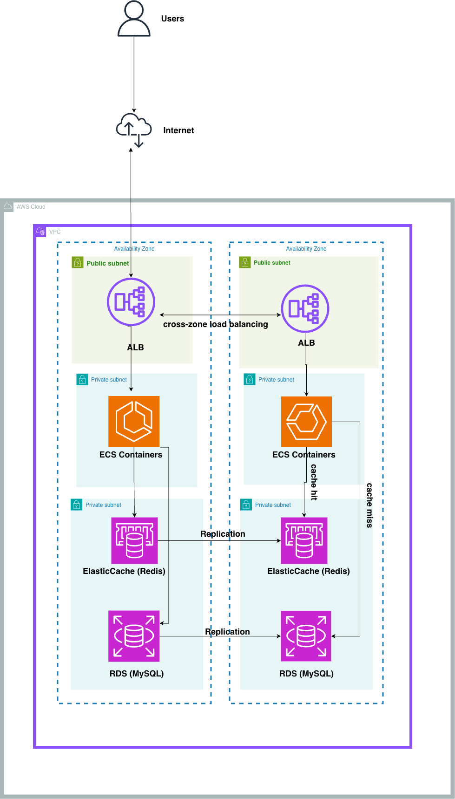

Move from a single-node ECS setup to a highly available AWS architecture using managed services for MySQL and Redis to reduce operational overhead.

Managed AWS (Preferred)
Use Amazon RDS/Aurora (Multi-AZ) for MySQL with automated backups, failover, and monitoring. Applications should handle transient disconnects with retries and short timeouts.
Use ElastiCache for Redis with Multi-AZ replication and automatic failover. Configure persistence based on data criticality, and ensure the app reconnects after failures.

Self-Hosted on Kubernetes (When Necessary)
Run MySQL and Redis inside a Kubernetes cluster (e.g., on Amazon EKS or self-managed Kubernetes on EC2).

MySQL:
Deploy via StatefulSets with persistent volumes (EBS). Use operators like Vitess for replication, failover, and scaling.
Ensure backups (snapshots), monitoring, and controlled failover.
Redis:
Deploy using StatefulSets with Redis Cluster. Tools like Redis Operator can automate failover and scaling.
Use persistent volumes if durability is required.

Application Changes
Implement retries with exponential backoff, short timeouts, connection re-creation, and idempotent operations. Avoid long transactions and log degraded dependencies.

Tradeoffs
Managed services offer easier operations, built-in failover, and reliability but add cost and some lock-in. Self-hosting provides control but significantly increases operational complexity.

https://drive.google.com/file/d/10-FBLG6bOlOT5egBPLgwg_RfbkcS-pNx/view?usp=drive_link
